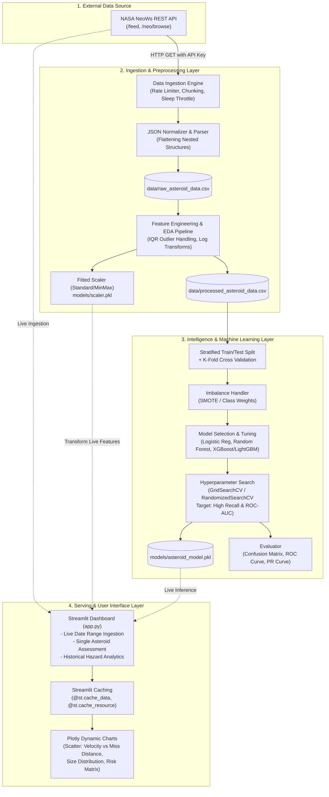

# 🌌 NeoWatch — System Architecture & Engineering Specification

> **End-to-End Machine Learning System for Near-Earth Object (NEO) Hazard Prediction & Real-Time Monitoring using NASA NeoWs API**

---

## 1. Executive Summary & Objective

**NeoWatch** is an enterprise-grade, end-to-end machine learning and monitoring platform. It fetches astronomical data on Near-Earth Objects (NEOs) from the **NASA NeoWs (Near Earth Object Web Service) REST API**, processes and engineers features, trains machine learning classifiers to predict hazard probability (`is_potentially_hazardous_asteroid`), and serves real-time threat intelligence through an interactive **Streamlit** dashboard.

### Core Objectives:
- **Zero Critical False Negatives**: In planetary defense, missing a hazardous asteroid (False Negative) has catastrophic implications. The ML pipeline is heavily optimized for **Recall** and **ROC-AUC** rather than raw accuracy.
- **Robust API Ingestion & Rate-Limiting**: Graceful extraction of historical (1–3 years) and live asteroid trajectories while respecting NASA's 7-day-per-query limit and HTTP 429 rate limits.
- **Modular & Production-Ready**: Strict separation of concerns (Ingestion -> Transformation -> Modeling -> Serving), deterministic preprocessing, and cloud-ready deployment.

---

## 2. High-Level System Architecture



---

## 3. Directory Structure & Modular Layout (NASA Proje Planı 2 Standard)

```
NeoWatch_Code/
├── .env.example               # Template for environment secrets (NASA_API_KEY)
├── .gitignore                 # Excludes .env, large CSV datasets, and model .pkl
├── requirements.txt           # Production dependencies and pinned versions
├── ARCHITECTURE.md            # System Architecture & Technical Specifications
├── PROJECT_BRAIN.md           # Living state, checklist, ADRs & progress tracking
├── app.py                     # Streamlit web dashboard (Presentation Layer)
│
├── data/                      # Dataset repository (excluded from Git)
│   ├── .gitkeep
│   ├── raw_data.csv                  # API'den gelen dokunulmaz ham veri (Checkpoint 1)
│   ├── processed_data.csv            # Temizlenmiş ve modele hazır veri (Checkpoint 2)
│   ├── raw_asteroid_data.csv         # Legacy alias
│   └── processed_asteroid_data.csv   # Legacy alias
│
├── models/                    # Serialized model & transformer artifacts
│   ├── .gitkeep
│   ├── scaler.pkl                    # Ön işleme (StandardScaler) objesi (Checkpoint 2)
│   ├── asteroid_xgb_model.pkl        # Eğitilmiş nihai ML modeli - XGBoost (Checkpoint 3)
│   └── asteroid_model.pkl            # Legacy alias
│
├── notebooks/                 # Exploratory research & modeling notebooks (Plan 2: 3 Notebooks)
│   ├── .gitkeep
│   ├── 01_data_extraction.ipynb      # API istekleri ve veri ayıklama (Parsing & Checkpoint 1)
│   ├── 02_eda_and_engineering.ipynb  # Keşifsel analiz, IQR, Heatmap, SMOTE (Checkpoint 2)
│   └── 03_model_training.ipynb       # 5-Fold CV, GridSearchCV, Recall/ROC-AUC (Checkpoint 3)
│
└── src/                       # Modular production-ready Python package
    ├── __init__.py
    ├── config.py              # Configuration constants, paths & env loader
    ├── api_client.py          # NASA API ile haberleşen fonksiyonlar (Aşama 1)
    ├── data_processor.py      # Veri temizleme & özellik mühendisliği fonksiyonları (Aşama 2)
    ├── predictor.py           # Model loading, inference & risk scoring engine
    ├── physics_engine.py      # Earth impact kinetic physics engine & Pi-scaling crater mechanics
    ├── collect_data.py        # CLI for batch historical data extraction
    └── train_pipeline.py      # Automated end-to-end ML training runner
```

---

## 4. Layer-by-Layer Technical Specification

### 4.1. Data Ingestion Layer (`src/api_client.py` & `notebooks/01_data_extraction.ipynb`)
- **API Endpoint**: `https://api.nasa.gov/neo/rest/v1/feed`
- **Constraint Management**:
  - NeoWs API restricts single-query date ranges to **maximum 7 days**.
  - Iterative 7-day sliding window loops across target time range (1–3 years).
  - Rate limiting handling: Configurable `time.sleep(0.25)` between requests and exponential backoff retry on HTTP 429 / 5xx responses.
- **Parsing & Flattening**:
  Extracts nested JSON payload into flat tabular records saved to `data/raw_data.csv` (**Checkpoint 1**):
  - `id`, `name`
  - `estimated_diameter_min_km`, `estimated_diameter_max_km`
  - `relative_velocity_km_s`, `relative_velocity_km_h`
  - `miss_distance_km`, `miss_distance_astronomical`, `miss_distance_lunar`
  - `close_approach_date`, `orbiting_body`
  - `is_potentially_hazardous_asteroid` (Target label: Boolean `[0, 1]`)

### 4.2. Preprocessing & Feature Engineering Layer (`src/data_processor.py` & `notebooks/02_eda_and_engineering.ipynb`)
- **Outlier Analysis & Treatment**:
  - Boxplot visualization + Interquartile Range (IQR) analysis with relaxed factor (3.0 * IQR) / 99.5th percentile capping to preserve astronomy physics while eliminating leverage.
- **Correlation & Multicollinearity**:
  - `seaborn.heatmap` analysis: `estimated_diameter_min_km` and `estimated_diameter_max_km` are ~99% correlated -> combined into `estimated_diameter_mean_km`.
- **Feature Scaling**:
  - `StandardScaler` fitted strictly on training split and saved to `models/scaler.pkl` to prevent data leakage during live inference.
- **SMOTE Balancing**:
  - Oversamples hazardous minority class ($\sim 11\% \to 50\%$) exclusively on training fold.

### 4.3. Modeling & Evaluation Layer (`src/model_trainer.py` & `notebooks/03_model_training.ipynb`)
- **Algorithms Evaluated**:
  1. *Baseline*: Logistic Regression (Linear benchmark)
  2. *Tree Ensemble*: Random Forest Classifier
  3. *Gradient Boosted Trees*: LightGBM & XGBoost
- **Validation Strategy**:
  - Stratified K-Fold Cross-Validation ($k=5$).
  - Hyperparameter tuning via `GridSearchCV` on XGBoost (`max_depth`, `n_estimators`, `learning_rate`, `subsample`, `scale_pos_weight`).
- **Primary Optimization Metrics**:
  - **Recall (Sensitivity)**: Minimizing False Negatives ($\text{FN} \le 2$).
  - **ROC-AUC & PR-AUC**: Discriminating power across probability thresholds.
- **Checkpoint 3 Output**: Serialized to `models/asteroid_xgb_model.pkl` (and legacy `asteroid_model.pkl`).

### 4.4. Serving & UI Layer (`app.py` & `src/predictor.py`)
- **Streamlit Dashboard Capabilities (Checkpoint 4)**:
  1. **Sidebar Navigation & Controls**: Dynamic date picker and live API trigger ("Ingest Live Stream").
  2. **Real-time Live Radar**: Ingests approaching asteroids live from NASA NeoWs, transforms with `scaler.pkl`, and scores threats with `asteroid_xgb_model.pkl`.
  3. **Visual Threat Map**: Dynamic Plotly scatter plots showing Velocity vs. Miss Distance with danger status color mapping and large telemetry metric cards.
  4. **Performance & Caching**:
     - `@st.cache_data` for API responses and CSV loading.
     - `@st.cache_resource` for loading `scaler.pkl` and `asteroid_xgb_model.pkl`.

### 4.5. Orbital Playground & Earth Impact Physics Engine (`src/physics_engine.py`)
- **Module Specification (Earth Impact Effects v1.0 What-If Architecture)**:
  - **Kinetic Yield**: $E_k = \frac{1}{2} m v^2 \text{ (J)}$, $E_{\text{megaton}} = \frac{E_k}{4.184 \times 10^{15}} \text{ (MT TNT)}$.
  - **Pi-Scaling Transient Crater**: $D_{tc} = 1.161 \left(\frac{\rho_i}{\rho_t}\right)^{1/3} D_i^{0.78} v^{0.44} g^{-0.22} \sin^{1/3}(\theta)$.
  - **Atmospheric Grazing Skip**: If impact angle $\theta < 10^\circ$, triggers atmospheric bounce condition and suspends surface excavation calculations.
  - **Damage Classification Matrix**:
    - $< 10\text{ Mt}$: Airburst (Atmosferik Patlama)
    - $10 - 100\text{ Mt}$: Local Destruction (Yerel Yıkım)
    - $100 - 100{,}000\text{ Mt}$: Regional Devastation (Bölgesel Yıkım)
    - $> 1{,}000{,}000\text{ Mt}$: Global Extinction Threat (Küresel Tehdit)
  - **3D Gamified Visualization**: Interactive 3D Earth globe with hypersonic trajectory vectors, atmospheric bounce paths, and concentric spherical shockwave ripple rings (Crater, 20 psi lethal blast, 5 psi residential collapse, fireball horizon).

---

## 5. Security & Deployment Strategy

1. **Secrets Management**:
   - Local: `.env` file loaded via `python-dotenv`.
   - Production (Streamlit Community Cloud): Encrypted secrets via `st.secrets["NASA_API_KEY"]`.
2. **Git Hygiene**:
   - Zero credentials or bulky CSV datasets committed.
3. **CI/CD & Live Demo**:
   - Linked GitHub repository with automated rebuild on push.
