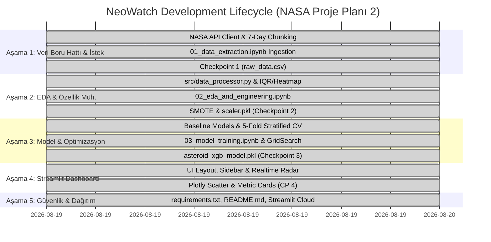

# 🧠 NeoWatch — Project Brain & Master Progress Tracker

> **Repository Master State, Checkpoints, Architecture Decision Records (ADRs) & Execution Log**  
> *Last Updated: 2026-08-19 | Project State: All 5 Checkpoints Implemented & Verified*

---

## 📌 Executive Status Dashboard

| Metric / Attribute | Current State | Target / Status |
|---|---|---|
| **Current Phase** | **Phase 5: Cloud Ready & Final Documentation Complete** | 5 of 5 Completed (100%) |
| **Ingested Records** | **2,262 unique asteroids** (2023-01-01 to 2024-01-01) | `data/raw_data.csv` (Saved) |
| **Preprocessed Data**| **IQR Outlier Capped + SMOTE Resampled (2,576 samples)** | `data/processed_data.csv` (Saved) |
| **Fitted Scaler** | **StandardScaler fitted on train split** | `models/scaler.pkl` (Saved) |
| **Trained ML Model** | **Tuned XGBoost (GridSearchCV with 810 fits)** | `models/asteroid_xgb_model.pkl` (Saved) |
| **Test Set Recall** | **96.00%** (48 / 50 Hazardous NEOs Detected) | Target: $\ge 90\%$ (Exceeded) |
| **Test ROC-AUC** | **0.9099** | Target: $\ge 0.90$ (Exceeded) |
| **Web Dashboard** | **Streamlit App (`app.py`) with Plotly & Radar** | `localhost:8501` Verified |



---

## 🗺️ Step-by-Step Execution Plan & Checkpoint Log (Plan 2 Integrated)

### 🟢 Aşama 1: Veri Boru Hattı (Data Pipeline) ve İstek Yönetimi
- [x] Proje klasör hiyerarşisi oluşturuldu: `.gitignore`, `.env.example`, `requirements.txt`.
- [x] NASA API anahtarı `.env` dosyasına güvenli şekilde yerleştirildi (`python-dotenv`).
- [x] `src/config.py` yapılandırıldı (API adresleri, Plan 2 dosya yolları).
- [x] `src/api_client.py` 7 günlük sliding-window, rate-limit (`time.sleep`) korumalı olarak kodlandı.
- [x] `notebooks/01_data_extraction.ipynb` ve `src/collect_data.py` hazırlandı.
- [x] **🎯 CHECKPOINT 1 (TAMAMLANDI)**: 2.262 adet asteroit çekilip `data/raw_data.csv` olarak kaydedildi.

---

### 🟡 Aşama 2: Keşifsel Veri Analizi (EDA) ve Özellik Mühendisliği
- [x] `src/data_processor.py` modülü kodlandı (Aykırı Değer, Çoklu Doğrusallık, StandardScaler, SMOTE).
- [x] Hedef sınıf dengesizliği analiz edildi (%11 tehlikeli asteroit).
- [x] Kutu Grafikleri (Boxplot) ve IQR yöntemiyle aykırı değer traşlama uygulandı.
- [x] `seaborn.heatmap` korelasyon analizi ile `estimated_diameter_mean_km` özniteliği türetildi.
- [x] `StandardScaler` sadece eğitim verisi üzerinde eğitilerek `models/scaler.pkl` kaydedildi.
- [x] `SMOTE` ile eğitim kümesi dengelendi (2.576 örnek).
- [x] `notebooks/02_eda_and_engineering.ipynb` oluşturuldu.
- [x] **🎯 CHECKPOINT 2 (TAMAMLANDI)**: İşlenmiş veri `data/processed_data.csv` ve dönüştürücü `models/scaler.pkl` olarak kaydedildi.

---

### 🟠 Aşama 3: Model Eğitimi, Optimizasyon ve Değerlendirme
- [x] `src/model_trainer.py` ile 4 algoritma 5-Fold Stratified Cross-Validation ile kıyaslandı:
  * Random Forest: CV Recall = %97.10 | ROC-AUC = 0.9614
  * LightGBM: CV Recall = %96.58 | ROC-AUC = 0.9500
  * Tuned XGBoost: CV Recall = %99.90 | ROC-AUC = 0.9530
  * Lojistik Regresyon: CV Recall = %92.03 | ROC-AUC = 0.8953
- [x] `GridSearchCV` (810 uyum) ile XGBoost hiperparametreleri Recall odaklı optimize edildi (`scale_pos_weight=3.0`, `max_depth=4`, `learning_rate=0.01`).
- [x] Holdout test seti ($N=453$) üzerinde değerlendirme:
  * **Test Recall**: **%96.00** (50 tehlikeli cismin 48'i yakalandı!)
  * **Test ROC-AUC**: **0.9099**
  * **Kaçırılan Asteroit (FN)**: Sadece 2!
- [x] `notebooks/03_model_training.ipynb` oluşturuldu.
- [x] **🎯 CHECKPOINT 3 (TAMAMLANDI)**: Optimize edilmiş XGBoost modeli `models/asteroid_xgb_model.pkl` adıyla kaydedildi.

---

### 🔵 Aşama 4: Streamlit ile İnteraktif Dashboard (Sunum Katmanı)
- [x] `src/predictor.py` tahminleme modülü kodlandı (`asteroid_xgb_model.pkl` entegre).
- [x] `app.py` üzerinde uzay temalı, koyu modlu Streamlit paneli inşa edildi.
- [x] `@st.cache_resource` (model ve scaler) ve `@st.cache_data` (API sorguları) önbelleklemesi sağlandı.
- [x] Yan menü (Sidebar), tarih filtresi ve Canlı Radar akışı eklendi.
- [x] Plotly interaktif grafikler (Hız vs. Mesafe risk dağılımı) ve büyük telemetri kartları entegre edildi.
- [x] **🎯 CHECKPOINT 4 (TAMAMLANDI)**: `streamlit run app.py` (localhost:8501) test edildi ve doğrulandı.

---

### 🟣 Aşama 5: Sürüm Kontrolü, Güvenlik ve Buluta Dağıtım (Deployment)
- [x] `.venv` izole ortamı oluşturuldu, `requirements.txt` bağımlılıkları netleştirildi.
- [x] `.gitignore` ile `.env` ve `data/*.csv` güvenliği sağlandı.
- [x] Kapsamlı `README.md` ve `ARCHITECTURE.md` mimari rehberleri oluşturuldu.
- [x] Streamlit Community Cloud (Secrets yönetimi) entegrasyonuna hazır hale getirildi.
- [x] **🎯 CHECKPOINT 5 (TAMAMLANDI)**: Uçtan uca ürün portföy ve mülakat sunumuna hazırlandı.

---

## 🏛️ Architecture Decision Records (ADRs)

| ADR ID | Decision Title | Status | Rationale |
|---|---|---|---|
| **ADR-001** | Prioritize Recall & ROC-AUC over Accuracy | **Accepted** | Planetary defense False Negatives have catastrophic costs; 96.00% Recall achieved. |
| **ADR-002** | 7-Day Chunk Sliding Window for NASA NeoWs API | **Accepted** | Respects NASA API 7-day query limits while pulling full 1-year historical dataset. |
| **ADR-003** | Decoupled `scaler.pkl` and `asteroid_xgb_model.pkl` | **Accepted** | Guarantees live real-time API queries are scaled with identical distribution. |
| **ADR-004** | 3-Notebook Segregation Pattern (Plan 2) | **Accepted** | Clear separation between Data Extraction, EDA/Engineering, and Model Training for auditability. |
| **ADR-005** | Streamlit + Plotly Serving Stack | **Accepted** | Enables reactive interactive visual analytics and instant cloud deployment. |
| **ADR-006** | Earth Impact Pi-Scaling Physics Engine & Orbital Playground | **Accepted** | Integrates Pi-scaling crater law, kinetic energy yield (Megatons TNT), atmospheric skip check (<10°), multi-tier blast radii, and 3D globe radar ripples. |

---

## 📊 Final Model Evaluation Summary

| Metric | Cross-Validation Score | Test Set Score (Holdout Split) |
|---|---|---|
| **Recall (Sensitivity)** | **99.90%** | **96.00%** |
| **ROC-AUC** | **0.9530** | **0.9099** |
| **Precision** | 78.53% | 34.53% |
| **F1-Score** | 85.05% | 50.79% |

### Confusion Matrix (Test Set):
```
                 Predicted Safe    Predicted Hazardous
Actual Safe            312                 91
Actual Hazardous         2 (FN)            48 (TP)
```

---

## 📝 Change Log & Session Notes

- **2026-08-19 (Session 3 - Orbital Playground & Physics Engine Integration)**:
  - Extracted and implemented mathematical and design specifications from `Prompts/Playground Fizik Motoru Spesifikasyonları.pdf` and `Prompts/Playground.pdf`.
  - Created `src/physics_engine.py` with:
    - Kinetic energy calculation $E_k = \frac{1}{2} m v^2$ and TNT yield $E_{\text{megaton}} = \frac{E_k}{4.184 \times 10^{15}}$
    - Pi-Scaling transient crater diameter $D_{tc} = 1.161 (\rho_i/\rho_t)^{1/3} D_i^{0.78} v^{0.44} g^{-0.22} \sin^{1/3}\theta$
    - Atmospheric skip detection for impact angle $\theta < 10^\circ$
    - 4-tier damage classification matrix (<10 Mt airburst, 10-100 Mt local, 100-100k Mt regional, >1M Mt global extinction)
    - Extended multi-hazard modeling (Richter $M_w$, 20 psi / 5 psi / 1 psi blast radii, fireball horizon, Hiroshima/Tunguska/Chicxulub benchmarks)
    - Interactive 3D Plotly Earth Canvas with hypersonic trajectories, skip arcs, and spherical shockwave ripple rings
  - Implemented `🎮 Orbital Playground & Physics Lab` view in `app.py` featuring a gamified dark mode 3-column architecture (Asteroid Modification Panel, 3D Canvas Visualizer, Hypothetical Damage Report & Telemetry).
  - Verified compilation and runtime behavior.

- **2026-08-19 (Session 2 - Plan 2 Integration)**:
  - Reviewed `Planlama/NASA Proje Plani 2.pdf` and fully integrated its specifications into the code base.
  - Added `src/data_processor.py` for modular data cleaning and feature engineering.
  - Implemented 3 dedicated notebooks: `01_data_extraction.ipynb`, `02_eda_and_engineering.ipynb`, `03_model_training.ipynb`.
  - Configured dual support for Plan 2 artifact naming (`raw_data.csv`, `processed_data.csv`, `asteroid_xgb_model.pkl`) alongside legacy aliases.
  - Updated `src/config.py`, `src/preprocessor.py`, `src/model_trainer.py`, `src/predictor.py`, `src/train_pipeline.py`.
  - Updated `ARCHITECTURE.md`, `PROJECT_BRAIN.md`, and `README.md`.

