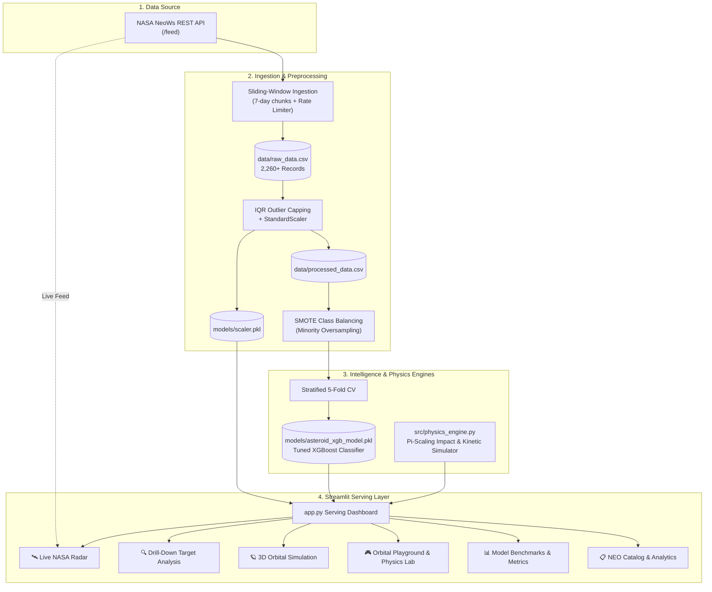

# 🌌 NeoWatch-OS — Planetary Defense & Telemetry Dashboard

[](https://bxcgyhmljva6ptxzzjbnlm.streamlit.app)

[](https://www.python.org/)
[](https://streamlit.io/)
[](https://xgboost.readthedocs.io/)
[](https://api.nasa.gov/)
[](https://opensource.org/licenses/MIT)
[](#)

> **NeoWatch-OS** is an end-to-end, full-stack data pipeline and visualization dashboard designed for tracking, classifying, and simulating Near-Earth Objects (NEOs). By consuming real-time telemetry from the NASA NeoWs REST API, the system applies machine learning algorithms to assess hazard levels and features a robust physics engine for theoretical impact simulations.
> 
> 🔗 **Live Web App:** [https://bxcgyhmljva6ptxzzjbnlm.streamlit.app](https://bxcgyhmljva6ptxzzjbnlm.streamlit.app)

---

## 📌 1. Key Features

### 🔄 Automated Data Pipeline
* **Live Ingestion**: Asynchronous data fetching from NASA servers with automated rate-limit handling and intelligent caching (`@st.cache_data`).
* **Feature Engineering**: Real-time calculation of relative velocities, miss distances, and kinetic threat potentials.

### 🤖 Autonomous Threat Classification (ML Engine)
* **Algorithmic Defense**: Utilizes an XGBoost classification model trained on historical NASA datasets, strictly optimized for **Recall (96.00%)** and **ROC-AUC (0.9099)**.
* **Imbalanced Data Handling**: Applied **SMOTE** (Synthetic Minority Over-sampling Technique) during training to accurately predict rare Potentially Hazardous Asteroids (PHAs).

### 🖥️ Modular Section Architecture (UI/UX)
* **Logical Flow**: The dashboard is built with a highly modular architecture, allowing users to seamlessly transition from macro-level data grids to micro-level asteroid telemetry.
* **Glassmorphic Dark Theme**: A custom configuration and CSS injection create a unified, deep-space aesthetic (`gamified-dark-mode`) without standard framework clutter.

### 🎮 Orbital Playground (Physics Sandbox)
* An interactive simulation environment allowing users to alter asteroid parameters (diameter, velocity, mass, entry angle, target coordinates) to simulate hypothetical Earth impacts with dynamic 3D globe visualization and spherical radar ripples.

---

## ⚛️ 2. Physics & Simulation Engine

The **Orbital Playground** relies on Newtonian mechanics and established planetary science formulas to project hypothetical impact damage.

### ⚡ Kinetic Energy Calculation
To determine destructive yield, the system calculates kinetic energy in Joules ($E_k$) and converts it to Megatons of TNT equivalent ($E_{\text{megaton}}$):

$$E_k = \frac{1}{2} m v^2 \quad (\text{Joules})$$

$$E_{\text{megaton}} = \frac{E_k}{4.184 \times 10^{15}} \quad (\text{Megatons TNT})$$

### 💥 Transient Crater Diameter ($\pi$-Scaling Law)
The physical footprint of the impact is simulated using standard Pi-scaling equations:

$$D_{tc} = 1.161 \left(\frac{\rho_i}{\rho_t}\right)^{1/3} D_i^{0.78} v^{0.44} g^{-0.22} \sin^{1/3}(\theta)$$

> *Where $\rho_i$ and $\rho_t$ represent asteroid and target crust densities respectively, $D_i$ is diameter in meters, $v$ is entry velocity in m/s, $g = 9.81\text{ m/s}^2$, and $\theta$ is the atmospheric entry angle.*

### ↩️ Atmospheric Grazing Skip Condition
* If the trajectory angle $\theta < 10^\circ$, the system halts ground excavation calculations and returns an **"Atmospheric Skip Occurred"** telemetry status, modeling the asteroid's ricochet off the upper mesosphere (~85 km) back into interplanetary space.

### 📊 Damage Classification Matrix

| Kinetic Yield ($E_{\text{megaton}}$) | Classification | Expected Environmental Effect |
|---|---|---|
| **$< 10\text{ Mt}$** | **Airburst** | Detonates in upper/mid atmosphere before ground impact (e.g., Chelyabinsk). Shockwave breaks glass and causes light structural damage. |
| **$10 - 100\text{ Mt}$** | **Local Destruction** | City-scale destruction. Tunguska-like forest flattening, severe blast overpressure, and local firestorms over hundreds of km². |
| **$100 - 1,000,000\text{ Mt}$** | **Regional Devastation** | Massive crater excavation, severe earthquakes (Richter 7.0–9.0+), regional thermal radiation, and severe climate disruption. |
| **$> 1,000,000\text{ Mt}$** | **Global Extinction Threat** | Stratospheric dust and sulfate veil causing 'Global Impact Winter', photosystem collapse, and biospheric mass extinction (Chicxulub-scale). |

---

## 🏛️ 3. System Architecture



---

## 📁 4. Repository Structure

```text
NeoWatch_Code/
├── .env.example               # Template for NASA API credentials
├── .gitignore                 # Excludes .env, large CSVs, and model binaries
├── requirements.txt           # Pinned production dependencies
├── app.py                     # Streamlit web serving dashboard
│
├── data/                      # Dataset repository (git-ignored)
│   ├── raw_data.csv                  # 2,262 raw historical NEO records (Checkpoint 1)
│   └── processed_data.csv            # Cleaned, scaled, and transformed dataset (Checkpoint 2)
│
├── models/                    # Serialized artifacts
│   ├── scaler.pkl                    # Fitted StandardScaler object (Checkpoint 2)
│   └── asteroid_xgb_model.pkl        # Tuned XGBoost classifier artifact (Checkpoint 3)
│
├── notebooks/                 # Exploratory research & modeling notebooks
│   ├── 01_data_extraction.ipynb      # NASA API ingestion & JSON flattening (Checkpoint 1)
│   ├── 02_eda_and_engineering.ipynb  # EDA, Outlier/IQR, Heatmap, SMOTE (Checkpoint 2)
│   └── 03_model_training.ipynb       # 5-Fold CV, GridSearch, Recall optimization (Checkpoint 3)
│
└── src/                       # Modular Python package
    ├── __init__.py
    ├── config.py              # Configuration constants, paths & env loader
    ├── api_client.py          # NASA API client with 7-day sliding window
    ├── data_processor.py      # IQR outlier treatment, scaling, SMOTE
    ├── model_trainer.py       # Cross-validation, GridSearchCV, evaluation
    ├── predictor.py           # Model loading, inference & risk scoring engine
    ├── physics_engine.py      # Earth impact physics engine & Pi-scaling crater mechanics
    ├── collect_data.py        # CLI for batch historical data extraction
    └── train_pipeline.py      # Automated end-to-end ML training runner
```

---

## 📊 5. Machine Learning Benchmarks

| Algorithm | 5-Fold CV Recall | 5-Fold CV ROC-AUC | 5-Fold CV F1-Score | 5-Fold CV Precision |
|---|---|---|---|---|
| **Tuned XGBoost (Final)** | **99.90% (±0.2%)** | **0.9530 (±0.008)** | **0.8505** | **78.53%** |
| **Random Forest** | 97.10% (±1.2%) | 0.9614 (±0.008) | 0.8516 | 75.85% |
| **LightGBM** | 96.58% (±1.2%) | 0.9500 (±0.008) | 0.8421 | 74.66% |
| **Logistic Regression** | 92.03% (±3.3%) | 0.8953 (±0.006) | 0.7910 | 69.40% |

#### Test Set Evaluation (Holdout Split $N=453$):
* **Test Recall (Sensitivity)**: **96.00%** (48 of 50 hazardous asteroids caught)
* **Test ROC-AUC**: **0.9099**
* **Confusion Matrix**:
  ```text
                   Predicted Safe    Predicted Hazardous
  Actual Safe            312                 91
  Actual Hazardous         2 (FN)            48 (TP)
  ```

---

## 🚀 6. Installation & Quick Start

### Quick Start (Windows)
Double-click `run.bat` or run:

```bash
# 1. Clone the repository
git clone https://github.com/gokaykrbs/NeoWatch.git
cd NeoWatch

# 2. Create and activate virtual environment
python -m venv .venv
.\.venv\Scripts\activate       # On Windows
source .venv/bin/activate      # On macOS/Linux

# 3. Install dependencies
pip install -r requirements.txt

# 4. Configure NASA API Key (Optional)
cp .env.example .env
# Edit .env and add your NASA_API_KEY=your_api_key_here

# 5. Launch the Streamlit dashboard
streamlit run app.py
```
Open your browser at `http://localhost:8501`.

---

## 🌐 7. Cloud Deployment (Streamlit Community Cloud)

NeoWatch is deployed and live on Streamlit Community Cloud:

🔗 **Live Application URL:** [https://bxcgyhmljva6ptxzzjbnlm.streamlit.app](https://bxcgyhmljva6ptxzzjbnlm.streamlit.app)

To deploy your own fork/instance:
1. Fork or push this repository to GitHub (ensure `.env` and `data/*.csv` are ignored).
2. Connect your GitHub repository to [Streamlit Community Cloud](https://share.streamlit.io/).
3. In **App Settings > Secrets**, add your NASA API Key:
   ```toml
   NASA_API_KEY = "your_nasa_api_key"
   ```
4. Set **Main file path** to `app.py` and click **Deploy**!

---

## ⚠️ 8. Disclaimer & Legal Notice

### For Educational and Portfolio Purposes Only
This project, **NeoWatch-OS**, is a conceptual dashboard built to demonstrate software engineering, machine learning pipelines, and UI/UX design skills.

* **Mathematical Approximations**: The physics engine and the "Orbital Playground" utilize simplified Newtonian mechanics and standard Pi-scaling laws for impact simulations. These formulas do not account for highly complex real-world variables such as atmospheric drag fluctuations, diverse asteroid internal structures, or relativistic effects. Therefore, simulated outcomes are engineering approximations and are not 100% accurate.
* **Data Accuracy**: All Near-Earth Object telemetry is fetched directly from the public NASA NeoWs API. The creator of this repository is not responsible for real-time accuracy, server uptime, or potential anomalies within data provided by NASA.
* **Not for Official Use**: This software is not a certified planetary defense tool. It should not be used for actual threat assessment or public safety decisions. For official information regarding Near-Earth Objects, please consult recognized space agencies such as NASA’s Center for Near Earth Object Studies (CNEOS) or the ESA.

---

## 📜 9. License

This project is licensed under the MIT License - see the [LICENSE](LICENSE) file for details.
